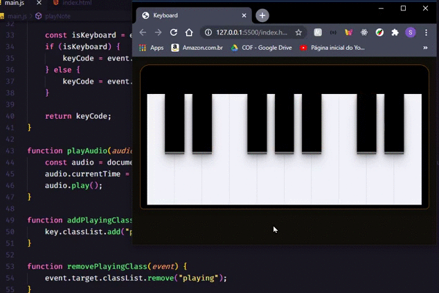

# Piano-dom :rocket:
 Repositório responsável por armazenar o mini projeto desenvolvido durante a Masterclass #18 da Rocketseat

## Apredizado :book:

Nesse mini projeto aprendi melhor as noções de manipulação do Document Object Model, principalmente no tocante à manipulação de eventos

## Tecnologias utilizadas :computer:

* HTML
* CSS
* JavaScript

## Como rodar o projeto :fire:

1. Clone este repositório
1. Execute o arquivo `index.html`
1. Caso não carregue o estilo ou o som, utilizar a extensão `Live Server`

##### Como amor :heart: Samuel Santos